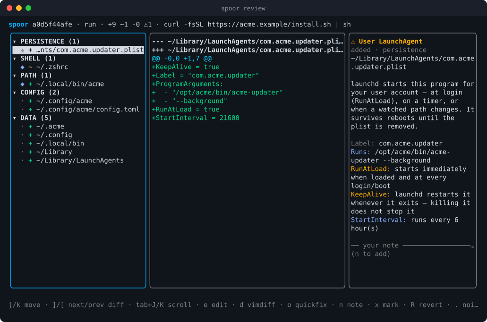
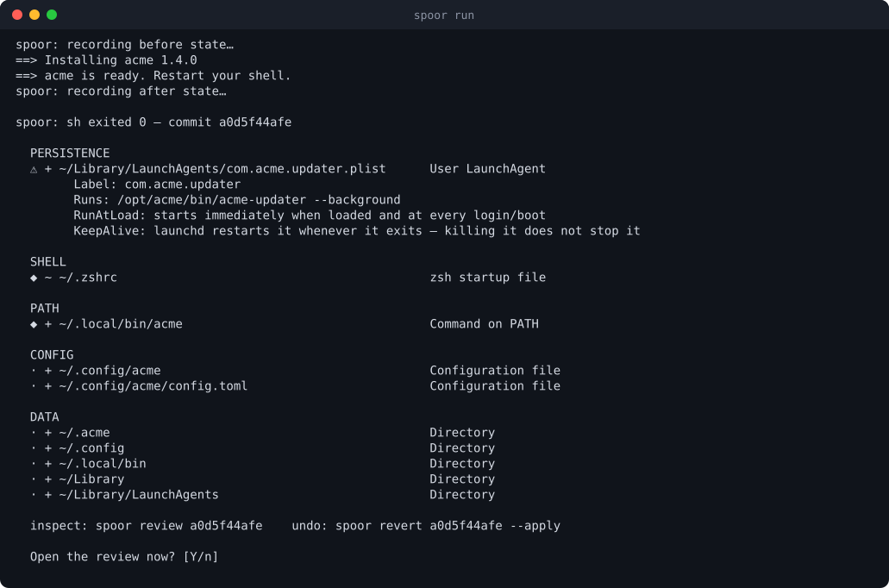
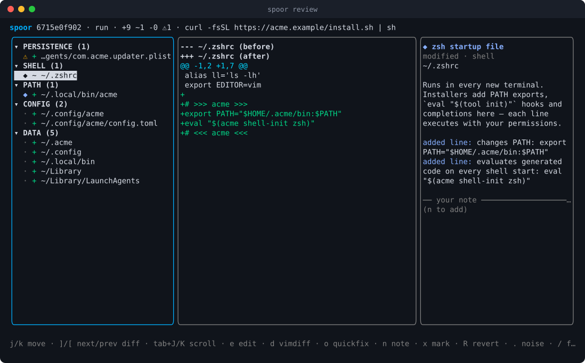
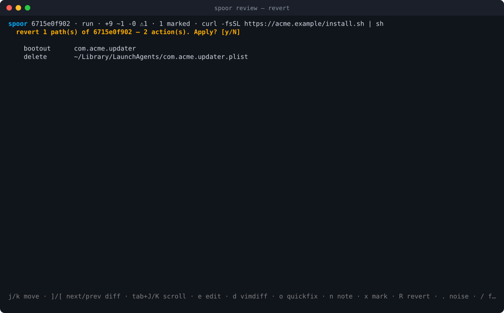
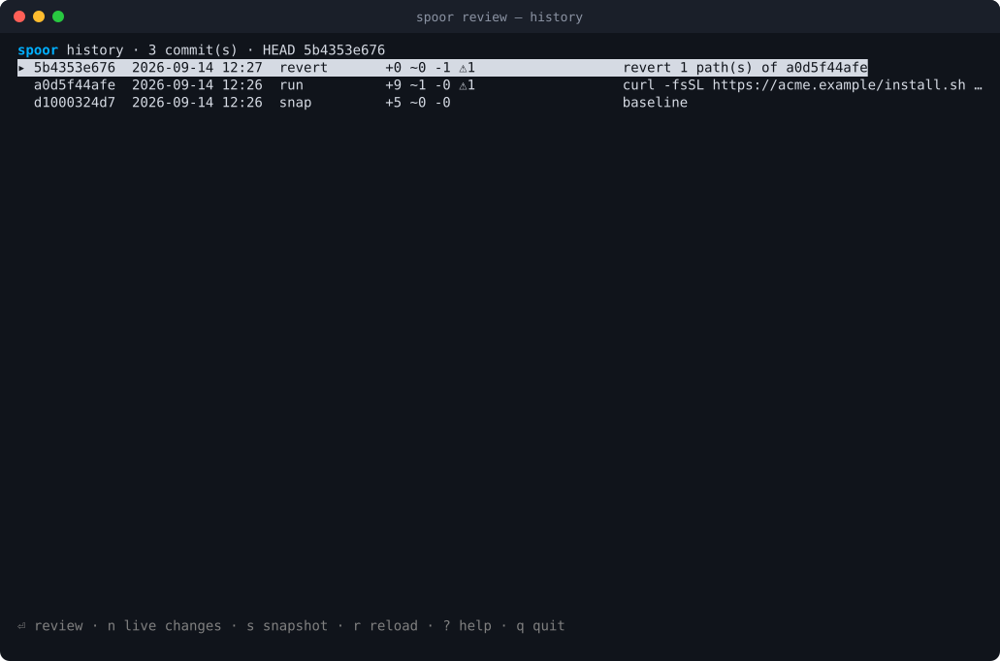
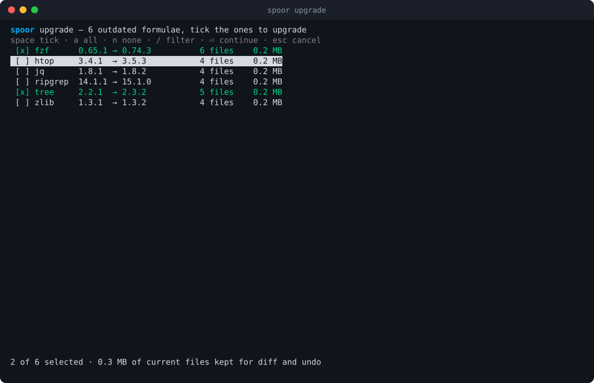
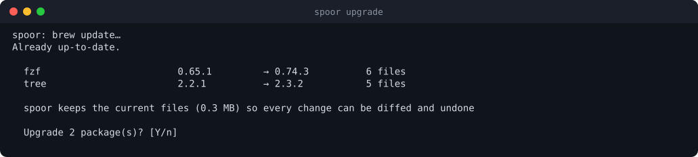
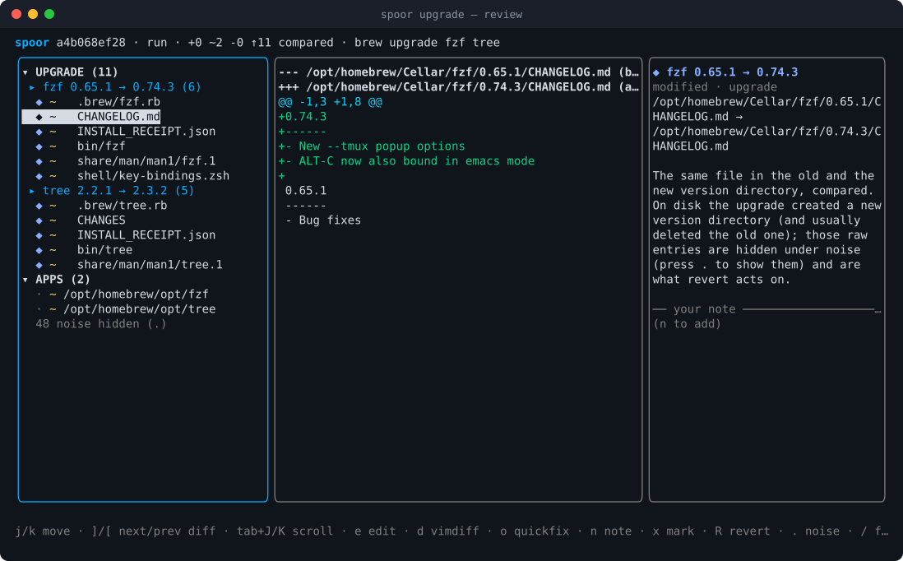
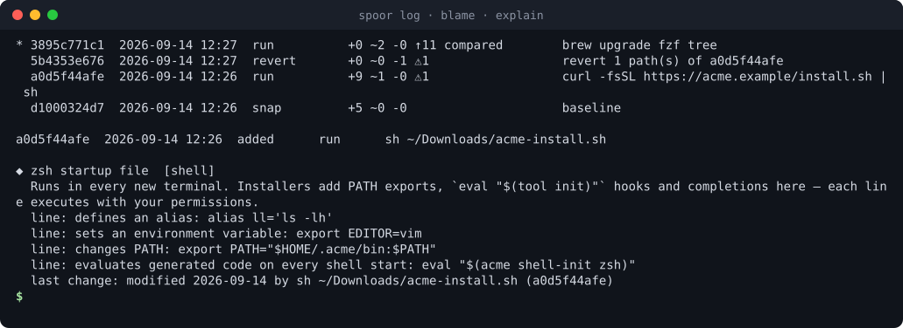
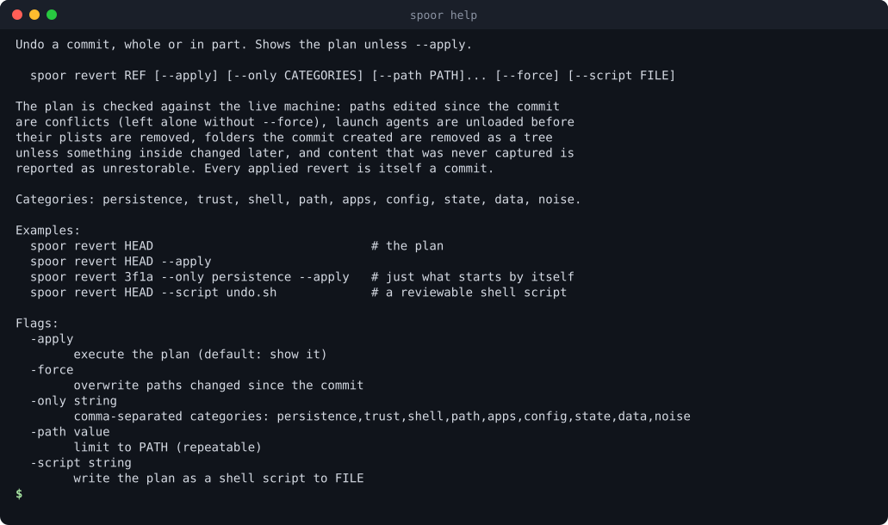

# spoor

**See what a command did to your machine. Inspect every change. Undo any of it.**

<p align="center"></p>

`curl … | sh`, `brew upgrade`, `npm i -g`, an app's "helper tool": each of them
changes files you never look at. They add launch agents that start at login,
append lines to your shell startup files, drop commands onto your `PATH` and
write config into `~/.config`. spoor records those parts of the machine before
and after, so you can see exactly what changed, why it matters and how to take
it back.

- **Record** any command, or just take snapshots now and then.
- **Review** every change in a terminal UI, grouped by risk, with real diffs,
  plain-language explanations and your own notes. Hand off to vim or vimdiff
  whenever you like.
- **Undo** a whole command or single files. Launch agents are unloaded,
  anything you edited since is left alone, and every undo can itself be undone.
- **Upgrade Homebrew packages** from a checklist, and read each upgrade as file
  diffs: changelog, man page, shell integration.
- **Keep history** of your machine: `log`, `diff` any two points, `blame` a
  file, `restore` one from any point.

It is a single Go binary for macOS and Linux with no runtime dependencies.

> Screenshots come from `scripts/screenshots.sh`: the real binary driven in a
> sandbox with a fictional installer and a simulated Homebrew.

## Contents

- [Install](#install)
- [Quick start](#quick-start)
- [A tour](#a-tour)
  - [1. Record an installer](#1-record-an-installer)
  - [2. Review what it did](#2-review-what-it-did)
  - [3. Undo it](#3-undo-it)
  - [4. Upgrade Homebrew packages](#4-upgrade-homebrew-packages)
  - [5. History, blame and notes](#5-history-blame-and-notes)
  - [6. Watch without running anything through spoor](#6-watch-without-running-anything-through-spoor)
  - [7. Linux: try before you apply](#7-linux-try-before-you-apply)
- [Getting help](#getting-help)
- [Command reference](#command-reference)
- [Review keys](#review-keys)
- [How it works](#how-it-works)
- [Undo: what spoor will and will not do](#undo-what-spoor-will-and-will-not-do)
- [Privacy](#privacy)
- [Limits](#limits)
- [Development](#development)
- [License](#license)

## Install

With Go 1.26 or newer:

```sh
go install github.com/morass/spoor/cmd/spoor@latest
```

Or from a checkout:

```sh
git clone https://github.com/morass/spoor
cd spoor
go build -o ~/.local/bin/spoor ./cmd/spoor
```

Make sure the folder is on your `PATH`, for example
`export PATH="$HOME/.local/bin:$PATH"` in `~/.zshrc` or `~/.bash_profile`.

Optional helpers: `vim`/`nvim` for the diff and quickfix hand-off. `eslogger`
(built into macOS 13+, needs root) or `strace` (Linux) for `--trace`.

## Quick start

```sh
spoor snap -m baseline                          # record the machine as it is now
spoor run -- sh -c "$(curl -fsSL https://example.com/install.sh)"
                                                # run something, see what it changed
spoor review                                    # browse history, diffs and notes
spoor revert HEAD                               # show how to undo the last command
spoor revert HEAD --apply                       # and do it
spoor upgrade                                   # pick Homebrew upgrades from a checklist
```

spoor keeps its history in `~/.local/share/spoor` (override with
`SPOOR_HOME`). The first recording takes about a second.

## A tour

### 1. Record an installer

Put `spoor run --` in front of any command. Its output and exit code pass
through unchanged. Afterwards spoor prints what changed, grouped by risk,
highlights what matters (here, a launch agent that restarts itself), and offers
to open the review.

```sh
spoor run -- sh -c "$(curl -fsSL https://acme.example/install.sh)"
```

<p align="center"></p>

Useful flags: `-m MESSAGE` names the commit, `--review` opens the review
without asking, `--no-review` never asks, `--add-root PATH` watches an extra
folder, and `--trace` records which process wrote each file.

### 2. Review what it did

`spoor review` (or answering **Y** after a run) opens three panes:

- **Changes**, grouped by risk: persistence first (launch agents, login items,
  cron, systemd units), then trust (SSH, hosts, package sources), shell startup
  files, commands on `PATH`, apps, config, data. Caches, logs and shell history
  are folded away as noise (press `.` to show them).
- **Diff** of the selected change. Binary and XML property lists are decoded
  into readable `key = value` lines, and binaries show their size change.
- **Notes**: what this kind of path is, what the analyzers found inside it
  (`KeepAlive`, schedules, programs, `PATH` edits, `eval`, `curl | sh`, code
  signatures), which process wrote it, and your own note.

<p align="center"></p>

`]` and `[` jump between changes that have a readable diff, `e` opens the file
in `$EDITOR`, `d` opens `vimdiff` on the recorded before and after, and `o`
opens a vim quickfix list of the whole commit. `n` attaches a note. Notes are
saved with the commit and shown by `spoor show` and `spoor blame`.

### 3. Undo it

Mark changes with `x` (or a whole category with `X`) and press `R`. spoor shows
the plan and asks before doing anything:

<p align="center"></p>

The undo is recorded as a new commit, so it can be reviewed and undone too:

<p align="center"></p>

The same from the command line:

```sh
spoor revert HEAD                               # the plan, nothing touched
spoor revert HEAD --apply                       # everything the command changed
spoor revert HEAD --only persistence --apply    # only what starts by itself
spoor revert HEAD --path ~/.zshrc --apply       # a single file
spoor revert HEAD --script undo.sh              # a shell script to read and run yourself
spoor restore ~/.zshrc --to HEAD~3 --apply      # one file as it was at any point
```

### 4. Upgrade Homebrew packages

`spoor upgrade` runs `brew update`, lists what is outdated and lets you tick
what to upgrade:

<p align="center"></p>

It shows the plan, including outdated dependencies brew would upgrade too, and
how much of the current files it keeps so every change can be diffed:

<p align="center"></p>

After the upgrade the review opens grouped as **package › files › diff**.
Homebrew installs each version into its own folder, so spoor pairs the old and
new folders and compares them file by file:

<p align="center"></p>

```sh
spoor upgrade                   # checklist
spoor upgrade jq ripgrep        # just these, plus their outdated dependencies
spoor upgrade --list            # what would change; touches nothing
spoor upgrade --all -y          # everything, no questions
spoor upgrade python@3.12       # install a versioned formula Homebrew ships
```

Homebrew cannot install arbitrary versions, only versioned formulae it ships,
and spoor says so instead of guessing. Undo an upgrade with `brew` itself: brew
deletes old versions, so pointing links back at them would leave broken
commands. Recording any other brew command works too: `spoor run -- brew
install NAME` watches that package's folder automatically.

### 5. History, blame and notes

<p align="center"></p>

```sh
spoor log                       # every run, snapshot, drift and revert
spoor log ~/.zshrc              # only the commits that touched a path
spoor show HEAD --patch         # one commit, with diffs
spoor diff HEAD~5 now           # any two points, or a point and the live machine
spoor blame ~/.local/bin/acme   # who put this here
spoor explain ~/.zshenv         # what a path is and why it matters
spoor note HEAD ~/.zshrc "acme's PATH hook, keep until the trial ends"
spoor export HEAD > footprint.md   # shareable summary with secrets redacted
```

Changes made outside spoor are not lost. Before recording anything, spoor
commits whatever changed since the last commit as **drift**, so `blame` can
still tell you when it appeared.

### 6. Watch without running anything through spoor

spoor works as a pure inspector too:

```sh
spoor snap                      # take a checkpoint now and then
spoor status                    # what changed since, without recording it
spoor review now                # inspect those live changes interactively
```

### 7. Linux: try before you apply

On Linux, `spoor try` runs a command on copy-on-write overlays of the watched
folders. The command sees the real files, but its writes land in a private
workspace. Review the result like any commit, then keep it or throw it away.

```sh
sudo spoor try -- ./install.sh
spoor review <id>
sudo spoor try apply <id>       # or: spoor try discard <id>
```

It needs root, or unprivileged user namespaces. Ubuntu restricts those, and
spoor explains how to proceed. It is not a sandbox: network access and anything
outside the overlays are real.

## Getting help

```sh
spoor --help                    # overview of all commands
spoor help upgrade              # one command: what it does, examples, flags
spoor revert --help             # same thing
```

<p align="center"></p>

Inside the review, `?` lists every key.

## Command reference

| Command | What it does |
|---|---|
| `spoor run [-m MSG] [--trace] [--add-root SPEC] -- CMD` | Record what `CMD` changes, then offer the review |
| `spoor snap [-m MSG]` | Record the current state if anything changed |
| `spoor upgrade [NAME...] [--list] [--all] [-y]` | Homebrew upgrades with captured files, then the review |
| `spoor try -- CMD` · `try apply REF` · `try discard REF` | Linux: preview a command on overlays |
| `spoor review [REF\|now]` | The interactive inspector |
| `spoor status [--patch]` | Live changes since the last commit |
| `spoor log [-n N] [PATH]` | History, or the history of one path |
| `spoor show [REF] [--patch] [--all]` | One commit with its changes and notes |
| `spoor diff A [B\|now] [--path P]` | Compare any two points |
| `spoor blame PATH` | Which commits (and processes) touched a path |
| `spoor explain PATH` | What a path is and why it matters |
| `spoor note REF PATH [TEXT]` | Read or write a note on a change |
| `spoor revert REF [--apply] [--only CATS] [--path P] [--force] [--script F]` | Undo a commit, whole or in part |
| `spoor restore PATH --to REF [--before] [--apply]` | Put one path back as it was |
| `spoor quickfix [REF] [-o FILE]` | A vim quickfix list of a commit |
| `spoor export [REF] [--format md\|json]` | A shareable, redacted summary |
| `spoor init [--root SPEC]... [--no-state]` | Choose what is watched |
| `spoor roots` · `gc` · `scrub` · `version` | Housekeeping |

`REF` is `HEAD`, `HEAD~2`, a commit id or a unique prefix of one. A root
`SPEC` is `PATH[:DEPTH[:content|meta]]`, for example `~/.config:3` or
`/Applications:1:meta`.

## Review keys

| Key | Action | Key | Action |
|---|---|---|---|
| `j` `k` `↑` `↓` | move | `]` `[` | next / previous readable diff |
| `tab` | switch pane | `J` `K` `space` | scroll the diff |
| `e` | open the file in `$EDITOR` | `d` | vimdiff before/after (`$SPOOR_DIFFTOOL` to change) |
| `o` / `Q` | open / write a quickfix list | `n` | write a note (`ctrl+s` saves) |
| `x` / `X` | mark a change / a category | `R` | revert the marked changes |
| `u` | write an undo script | `.` | show or hide noise |
| `/` | filter | `i` | narrow terminals: diff ↔ notes |
| `esc` | back to history | `q` | quit |

In the history screen: `⏎` reviews a commit, `n` reviews live changes and `s`
takes a snapshot.

## How it works

**Watched roots.** spoor does not scan the whole disk. It watches the places
software installs itself into: dotfiles, `~/.config`, `~/.ssh`, launch agents
and daemons, login items, `/Applications`, privileged helpers, `/etc/paths.d`,
`/opt/homebrew/bin`, `~/.local/bin` and friends (on Linux, `/etc`, systemd
units, `/usr/local`, `/opt`). `spoor roots` prints the list and `spoor init`
replaces it. Content roots keep file bodies up to 1 MiB so they can be diffed
and restored. Metadata roots record type, size, mtime and mode.

**System state.** Loaded launchd jobs, your crontab and listening TCP ports
(systemd user units on Linux) are recorded as virtual `@state/…` entries and
diffed like files.

**Store.** A content-addressed object store with compressed manifests, commits,
notes and traces, in a folder with mode 0700. On APFS, file bodies are captured
with `clonefile(2)`, which is instant and shares disk blocks until the file
changes.

**Commits.** `run` and `snap` record, `revert` and `restore` undo, `drift`
catches changes made in between, and `try` records previews. Every command
works on the same history.

**Understanding changes.** A small knowledge base maps paths to categories,
risk levels and explanations. Analyzers read launchd property lists, systemd
units, lines added to shell files, binary type and code signature. Version
folders (`Cellar/tree/2.2.1` → `2.3.2`) are paired so upgrades read as file
diffs.

## Undo: what spoor will and will not do

- It plans against the **live** machine. A file edited again since the commit
  is a conflict and is left alone unless you pass `--force`.
- It unloads launch agents and daemons (`launchctl bootout`) before removing
  their plists.
- It removes a folder the command created as a whole tree, including contents
  deeper than it watched, unless something inside changed afterwards.
- It checks each file again just before acting, refuses to follow a parent
  folder that has become a symlink, and keeps setuid and setgid bits.
- It never guesses content it did not capture. Such changes are reported as
  **unrestorable**.
- Every applied undo is a new commit.

## Privacy

spoor keeps copies of watched files so it can diff and undo them. It never
keeps:

- **files whose name marks them as secret**: SSH keys (anything in `~/.ssh`
  except `config`, `known_hosts`, `authorized_keys` and `*.pub`), `*.pem`,
  `*.key`, `.env*`, `.npmrc`, `.pypirc`, `.netrc`, `.git-credentials`, the
  `gh`, `gcloud`, `aws`, `azure`, `kube` and `docker` credential folders,
  password stores, keychains, shell histories, `/etc/shadow`;
- **files whose contents look secret**, whatever their name: private keys,
  known token formats, credentials inside URLs, `Authorization` headers, and
  literal values assigned to secret-named keys (`AWS_SECRET_ACCESS_KEY=…`). A
  reference like `TOKEN="$VAR"` is fine.

Such files are still hashed, so a change to them shows up, but their contents
are never stored, shown, exported or restorable. The same check covers
recorded state (a crontab line with a token), and command lines are stored with
secret arguments redacted. `spoor scrub` removes anything older versions kept.

`spoor export` is for sharing. It redacts tokens, keys, passwords, authorization
headers, e-mail addresses, SSH host details and home directories. It is still
pattern based, so read an export before you publish it. Temporary files for
vimdiff are deleted when vimdiff exits.

## Limits

- Only watched roots are seen. A write elsewhere is invisible unless you add a
  root (`--add-root`) or record with `--trace`.
- In metadata-only roots a modified file is detected but cannot be restored.
- Unloading system launch daemons needs root. `--trace` on macOS needs root
  for `eslogger`.
- On macOS, folders protected by privacy controls are skipped. Give your
  terminal Full Disk Access to include them.
- spoor is an inspector, not a sandbox: it records what a command did and helps
  undo it; it does not stop the command.

## Development

```sh
go test ./...                   # unit, TUI and end-to-end tests (real binary, sandboxed HOME)
scripts/tui-smoke.sh            # drives the real review UI in tmux and checks the screen
scripts/screenshots.sh          # regenerates docs/images/*.svg in a sandbox
scripts/prepublish-check.sh     # fails on e-mail identities, home paths, token literals, agent files
```

The end-to-end tests check, byte for byte, that `revert` restores the recorded
tree, that reverting the revert brings the change back, and that conflicts,
forced reverts, restore, drift, blame, upgrades, secrets and redaction behave
as described. On Linux, run them as root to include `try`:

```sh
go test -c -o e2e.test ./e2e && go build -o spoor ./cmd/spoor
sudo env SPOOR_BIN=$PWD/spoor ./e2e.test -test.v
```

Layout: `cmd/spoor` (CLI and help), `internal/app` (operations), `store`,
`scan`, `diff`, `kb` (knowledge base and analyzers), `revert`, `trace`, `try`,
`brew`, `redact`, `tui`, `e2e/`, and `scripts/ansi2svg` (screenshot renderer).

## License

[MIT](LICENSE): use it, change it, share it, sell it. Keep the copyright notice.
